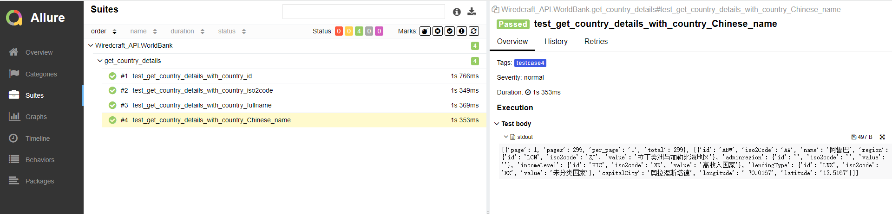

1 install required python package:\
python -m pip install -r ./requirements.txt

2 download and unzip allure zip file:\
downoad url:\
https://repo.maven.apache.org/maven2/io/qameta/allure/allure-commandline/2.17.0/allure-commandline-2.17.0.zip

3 set the bin folder in the unzipped allure folder to PATH env variable

4 run a specific test suite:\
pytest --alluredir=.\allure-results .\Wiredcraft_API\WorldBank\get_country_details.py

5 generate report:\
allure generate --clean

6 view the generated report:\
allure serve -h 127.0.0.1 -p 8080

